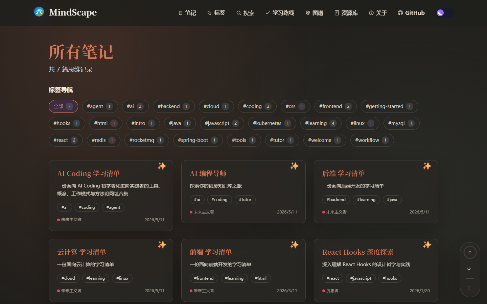
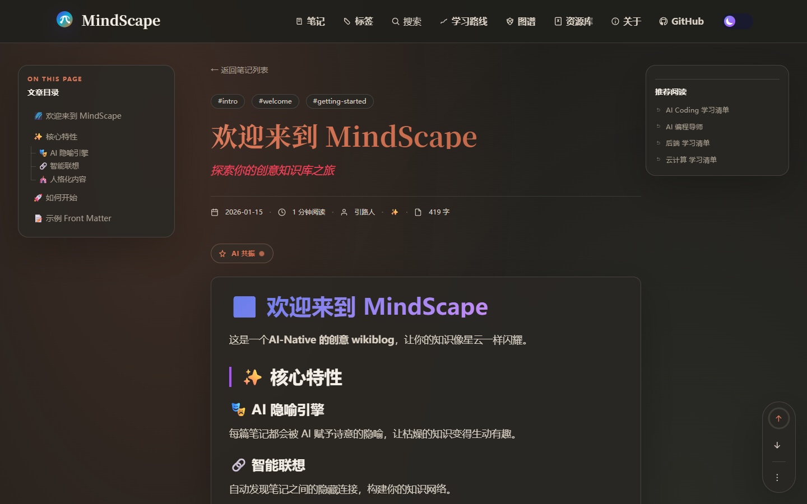
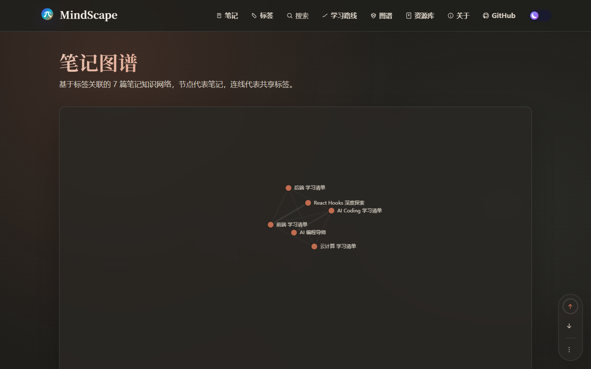
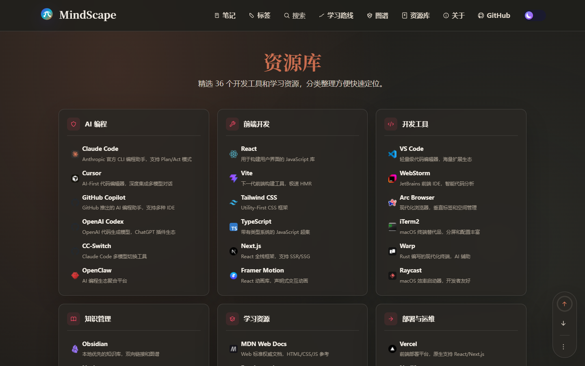
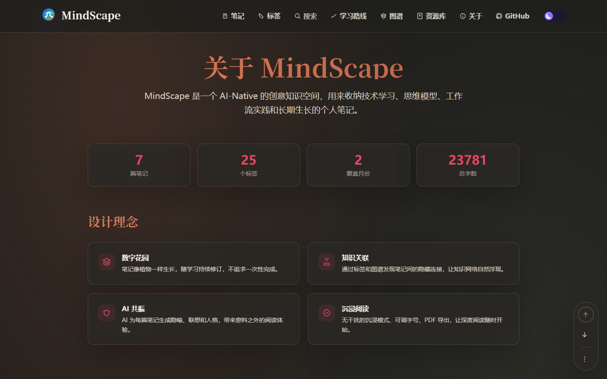

# MindScape — AI-Native Knowledge Studio

将 Markdown 笔记转化为可探索的思维星图。AI 隐喻、标签图谱、学习路线、参考文档预览——不是归档文章，而是在每次阅读时重新生成线索。

## 页面预览


| 演示 GIF |
|:---:|
|  |

| 首页 | 笔记列表 |
|:---:|:---:|
|  |  |

| 笔记阅读 | 参考文档 |
|:---:|:---:|
|  |  |

| 知识图谱 | 学习路线 | 资源库 |
|:---:|:---:|:---:|
|  |  |  |

| 关于 |
|:---:|
|  |

## 核心特性

### 知识图谱
- **双向链接图谱** — 基于共享标签自动构建笔记间的关联网络，支持缩放、拖拽和节点点击导航
- **笔记侧栏图谱** — 阅读笔记时在右侧展示当前笔记的关联子图
- **推荐阅读** — 基于标签匹配自动推荐相关笔记

### 学习路线
- **交互式流程图** — 使用 React Flow 构建的可拖拽路线图，支持滚动缩放
- **多路线切换** — 预设 AI Coding、前端工程、知识管理等多条学习路径
- **资源卡片** — 每张卡片展示层级、Favicon 封面、名称、分类标签和域名描述，支持点击跳转

### 资源库
- **分类整理** — AI 编程、前端开发、开发工具、知识管理、学习资源、部署运维六大分类
- **Favicon 集成** — 自动从 Yandex Favicon 服务获取网站图标
- **外部链接预览** — 点击直接跳转至目标资源

### 阅读体验
- **参考文档卡片** — 博文底部展示外部参考链接的自动预览（标题、描述、封面、站点名称）
- **滚动进度环** — 右下角工具栏显示阅读进度百分比
- **沉浸模式** — 隐藏所有 UI 元素，专注阅读
- **目录导航** — 支持 h1~h3 标题的自动目录生成
- **Markdown / PDF 导出** — 一键下载 Markdown 源文件或通过打印生成 PDF
- **全屏阅读** — 支持浏览器全屏模式

### AI 增强
- **AI 隐喻面板** — 为每篇笔记生成诗意的隐喻描述
- **智能联想** — 自动发现笔记间的隐藏连接
- **笔记人格化** — 赋予每篇笔记独特的性格标签（沉思者、引路人、园丁等）
- **情绪能量分析** — 可视化展示笔记的情感基调

### 视觉设计
- **粒子场背景** — 动态星云粒子效果
- **鼠标光晕追踪** — 跟随鼠标移动的柔和光晕
- **玻璃拟态设计** — 半透明磨砂玻璃效果
- **明暗主题切换** — 支持明亮/暗黑模式

## 快速启动

```bash
cd mindscape
npm install
npm run dev
```

服务器默认在 `http://localhost:5173` 启动。

## 技术栈

| 类别 | 技术 |
|------|------|
| 框架 | React 19 + TypeScript |
| 构建 | Vite 8 (Rolldown) |
| 路由 | react-router-dom v7 |
| 动画 | Framer Motion |
| 图谱 | d3-force + d3-selection |
| 流程图 | @xyflow/react (React Flow) |
| 样式 | CSS Custom Properties + 响应式布局 |

## 项目结构

```
mindscape/
├── src/
│   ├── components/
│   │   ├── AIPanel.tsx              # AI 增强面板
│   │   ├── FloatingTools.tsx        # 浮动工具栏（滚动进度、导出等）
│   │   ├── LearningRoadmapFlow.tsx  # 学习路线流程图
│   │   ├── MarkdownContent.tsx      # Markdown 渲染组件
│   │   ├── MouseGlow.tsx            # 鼠标光晕效果
│   │   ├── NoteCard.tsx             # 笔记卡片
│   │   ├── NoteGraph.tsx            # 全屏知识图谱
│   │   ├── NoteGraphSidebar.tsx     # 笔记侧栏关联图谱
│   │   ├── ParticleField.tsx        # 粒子场背景
│   │   ├── RandomWalkButton.tsx     # 随机漫步按钮
│   │   └── ThemeToggle.tsx          # 主题切换
│   ├── utils/
│   │   ├── noteData.ts              # 笔记数据
│   │   └── noteLoader.ts            # 笔记加载器
│   ├── App.tsx                      # 主应用组件（含所有页面）
│   ├── main.tsx                     # 入口文件
│   └── index.css                    # 全局样式
├── screenshots/                     # 页面截图
├── index.html
├── package.json
└── vite.config.ts
```

## License

MIT © 2026 MindScape
